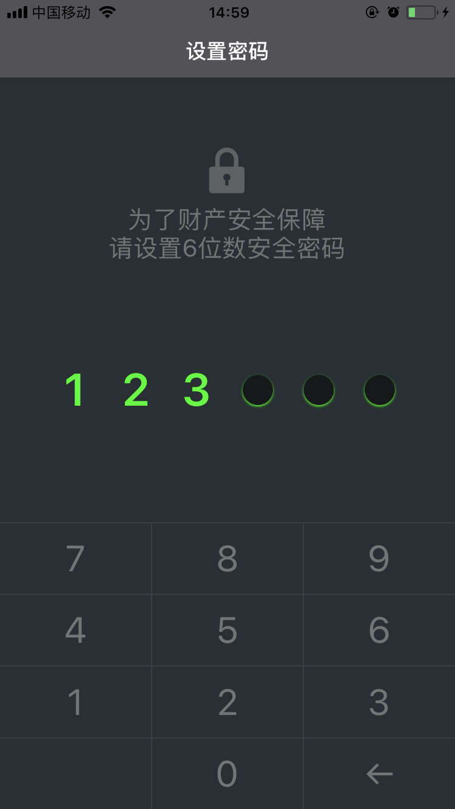
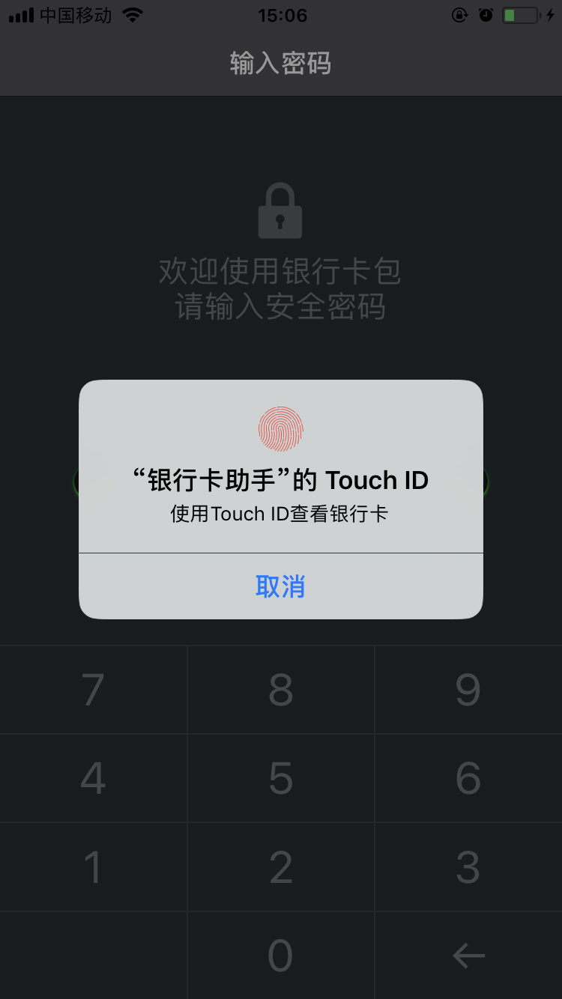
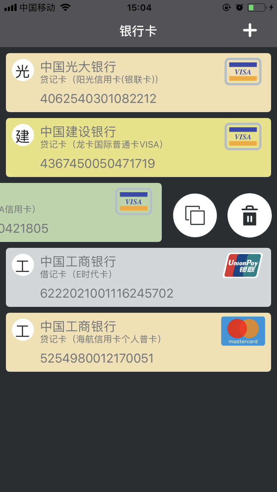
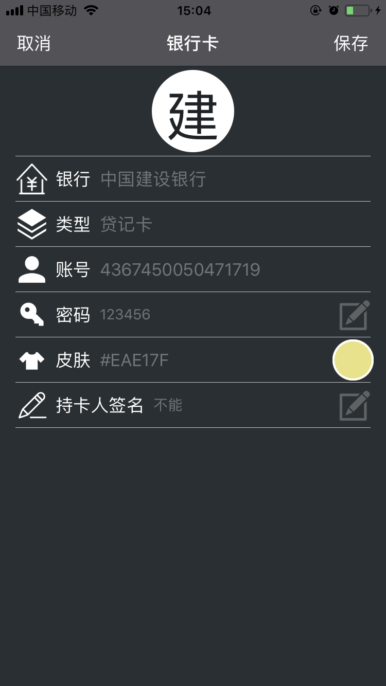
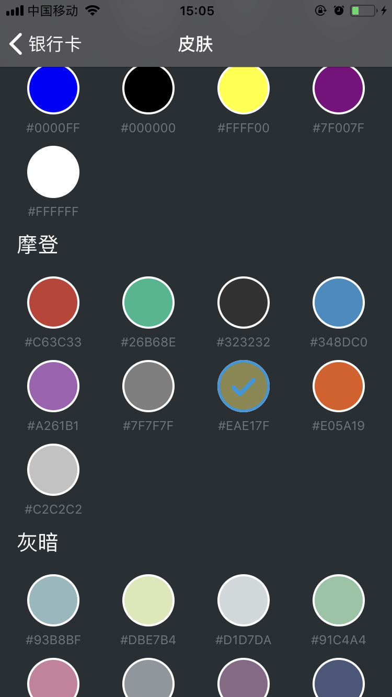

#Bankcard Packet

>This is a simple bankcard packet applciation and there are 4 viewcontrollers only.

###Feature
	1: Touch ID.
	2: Recognition bank card info with number.
	3: Customer bank card background color.
	4: Mutil-Language. (Chinese & English)
	5: ... I can't boast more.

### UI

###Note
	Please install cocoapods & execute cmd 'pod install' before build target.
	
	